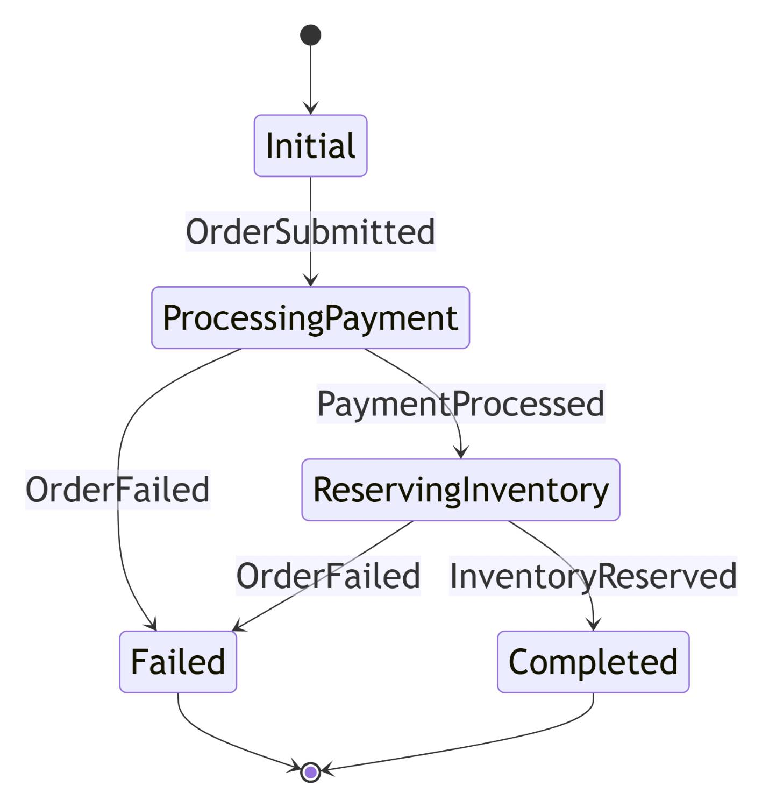

# .Net 8.0 Microservice Project
<br />
**Microservices** architecture, or simply microservices, comprises a set of focused, independent, autonomous services that make up a larger business application. The architecture provides a framework for independently writing, updating, and deploying services without disrupting the overall functionality of the application. Within this architecture, every single service within the microservices architecture is self-contained and implements a specific business function. For example, building an e-commerce application involves processing orders, updating customer details, and calculating net prices. The app will utilize various microservices, each designed to handle specific functions, working together to achieve the overall business objectives.

<br />

<br /><br />

Adopting a microservices architecture brings a range of benefits that can transform how organizations build and operate software. One of the primary advantages is the ability to scale individual services independently, which helps optimize resource usage and eliminates bottlenecks that can affect the entire application. This independent scalability also means that development teams can deploy services independently, reducing the risk of system-wide outages and enabling continuous delivery of new features. Deployments can be performed with one service at a time or span multiple services, depending on the specific needs of the deployment.
<br /><br />

## ✅ Whats Including In This Repository
I have implemented below features.

#### Order microservice which includes; 
* NET 8.0 Web API application 
* REST API principles, CRUD operations
* **SQL Server database (MicroShop)** connection
* Repository Pattern Implementation
* Swagger Open API implementation
* Consume Events (BasketCheckoutConsumer)	
* Publish OrderCreateEvent event with using **MassTransit and RabbitMQ**

#### Basket microservice which includes;
* NET 8.0 Web API application
* REST API principles, CRUD operations
* **Redis database** connection
* Consume Discount **Grpc Service** for inter-service sync communication to calculate product final price
* Publish BasketCheckout event with using **MassTransit and RabbitMQ**
  
#### Discount microservice which includes;
* NET 8.0 **Grpc Server** application
* Build a Highly Performant **inter-service gRPC Communication** with Basket Microservice
* Exposing Grpc Services with creating **Protobuf messages**
* Using **ADO.Net implementation** to simplify data access and ensure high performance
* **SQL Server database (MicroShopDiscount)** connection

#### Inventory microservice which includes; 
* NET 8.0 Web API application 
* Consume Events (ProcessInventoryConsumer)
* **SQL Server database (MicroShop)** connection
* Repository Pattern Implementation
* Swagger Open API implementation	
* Publish InventorySuccessEvent event with using **MassTransit and RabbitMQ**

#### Payment microservice which includes; 
* NET 8.0 Web API application 
* Consume Events (ProcessPaymentConsumer)
* **SQL Server database (MicroShopPayment)** connection
* Repository Pattern Implementation
* Swagger Open API implementation	
* Publish PaymentSucceededEvent event with using **MassTransit and RabbitMQ**

#### Microservices Communication
* Sync inter-service **gRPC Communication**
* Async Microservices Communication with **RabbitMQ Message-Broker Service**
* Using **RabbitMQ Publish/Subscribe Topic** Exchange Model
* Using **MassTransit** for abstraction over RabbitMQ Message-Broker system
* Publishing BasketCheckout event queue from Basket microservices and Subscribing this event from Ordering microservices (BasketCheckoutConsumer) and the rest of the ordering flow with Masstransit saga State Machine  (MassTransitStateMachine : OrderStateMachine)
* Create **RabbitMQ EventBus.Messages library** and add references Microservices

#### Ordering Microservice
* Implementing **DDD, CQRS, and Clean Architecture** with using Best Practices
* Developing **CQRS with using MediatR, FluentValidation and AutoMapper packages**
* Consuming **RabbitMQ** BasketCheckout event queue with using **MassTransit-RabbitMQ** Configuration
* **SQL Server database** connection
* Using **Entity Framework Core ORM** and migratation to SQL Server Manually.
	
#### API Gateway Ocelot Microservice
* Implement **API Gateways with Ocelot**
* Sample microservices/Consul to reroute through the API Gateway	
* The Gateway aggregation pattern in MicroShop.Aggregator

#### Microservices Cross-Cutting Implementations
* Implementing **Centralized Logging with SeriLog** for Microservices
* Use the **Consul HealthChecks** feature in back-end ASP.NET microservices

#### Microservices Resilience Implementations
* Making Microservices more **resilient Use IHttpClientFactory** to implement resilient HTTP requests
* Implement **Retry patterns** with **MassTransit UseMessageRetry**

#### Microservices Deployments & Service Discovery
* Implementing **Consul Cluster** with a server and a client agent for **Service Discovery**
* **Register** each service to mentioned Consul nodes with Hostnames
* Using **Steeltoe** library to register and resolve the services

<br />

# 🎨 State Diagram
#### Ordering flow with Masstransit Saga State Machine (OrderStateMachine)

**Transitions** between these states are triggered by user actions or system processes (Saga), providing a clear overview of the customer journey from initial product search to final purchase and order confirmation.



<br />

## 📦 Domain-Driven Design — Order Service

Order.API is an independent Bounded Context in the microservices architecture responsible for managing the complete lifecycle of an order.
It contains the core business logic for order creation, validation, inventory reservation, discount calculation, and payment initiation.

## 🧩 Core Domain

#### Order Aggregate

* Order acts as the Aggregate Root

* OrderItem (Child Entity)

* Contains order items (OrderItems)

* EnumOrderState → Value Object / Domain Enum

* Event Bus Consumers → Domain Event Handler / Integration Event Handler

* Enforces domain rules such as:

   * Calculating total price

   * Validating order status

   * Managing state transitions (Pending → Paid → Completed → Cancelled)

## 📚 Application Layer

* Implements CQRS

    * Commands: create order, update order state, cancel order

    * Queries: retrieve orders

* Uses Handlers to orchestrate processes

* Coordinates domain logic with external services

## 🏛  Infrastructure Layer

* Implements Repository pattern in alignment with DDD

* Uses EF Core for database communication

* Maps Domain Models ←→ Persistence Models

* Manages Unit of Work through EF Core context

## 🔗 Inter-Context Relationships (Context Map)

#### Order Context interacts with several other services:

| Service            | DDD Relationship    | Description                                                          |
| ------------------ | ------------------- | -------------------------------------------------------------------- |
| **Basket**         | Conformist          | Order follows the data model shaped by Basket.                       |
| **Discount**       | Customer → Supplier | Discount rules are defined by Discount service; Order consumes them. |
| **Inventory**      | Supplier + ACL      | Order requests stock reservation;            |
| **Payment**        | Supplier            | Order initiates the payment workflow.                                |
| **Ocelot Gateway** | Open-Host Service   | Order is exposed externally via the API Gateway.                     |


## 🎯 Responsibilities Summary

#### The Order Service is responsible for:

* Receiving the user's basket and converting it into an order

* Validating discount information via Discount service

* Reserving stock through Inventory service

* Initiating payment via Payment service

* Managing the full lifecycle of an order and its domain events

<br />

# 🎉 Databases Migrations
#### Entity Framework's Migrations & Migrations Scaffolding :
```
Scaffold-DbContext "Data Source=.;Initial Catalog=MicroShop;Integrated Security=True;TrustServerCertificate=True" Microsoft.EntityFrameworkCore.SqlServer -OutputDir Context -Force
```
```
Scaffold-DbContext "Data Source=.;Initial Catalog=MicroShopLogDB;Integrated Security=True;TrustServerCertificate=True" Microsoft.EntityFrameworkCore.SqlServer -OutputDir LogContext -Force
```
```
Scaffold-DbContext "Data Source=.;Initial Catalog=MicroShopPayment;Integrated Security=True;TrustServerCertificate=True" Microsoft.EntityFrameworkCore.SqlServer -OutputDir Context -Force
```
```
Add-Migration InitOrderSaga -c OrderStateDbContext
Update-Database -Context OrderStateDbContext
```
```
Add-Migration InitialOrderEventStoreMigration -c OrderEventStoreDbContext 
Update-Database -Context OrderEventStoreDbContext
```

#### 📌 Databases :


<br /><br />

# 🚀 Project Structure :


<br />

# Consul Registeration (Service Discovery)

#### appsettings.json:
```
"spring": {
    "application": {
      "name": "basket-service"
    }
  },
  "steeltoe": {
    "client": {
      "consul": {
        "discovery": {
          "host": "Consul1",
          "port": 8500,
          "scheme": "http",

          "register": true,
          "serviceName": "basket-service",

          "healthCheckPath": "/health",
          "healthCheckInterval": "10s",

          "useNetUtils": false
        }
      }
    }
  }
```
#### Program.cs :
```
builder.Services.AddDiscoveryClient(builder.Configuration);

builder.Services.AddHealthChecks();

// HealthCheck endpoint for Consul
app.MapHealthChecks("/health");

// Register to Consul
app.UseDiscoveryClient();
```

#### Consul Nodes on Ubuntu http://192.168.56.164:8500/ui :


#### Registered Services :


#### Order Service (e.g.) :


#### DNS Settings :


#### Running the Services in Consul Nodes :
```
dotnet restore
dotnet build
dotnet run
```
#### Discount.gRPC runs with http://Consul1:5046 :


#### Get discount info from above gRPC address at basket :


#### Ocelot Gateway runs on http://Consul2:8000 :


#### Get access to Order Service from the other Consul Machine :


#### Get access to Basket Service from the other Consul Machine :


<br />

# Call the Services via gateway :

#### Add items to the customer's basket :


#### Checkout the basket with a tracking code (Awaiting Payment) :


#### Payment for the related order :


#### Order State Before Payment :


#### Order & Items records :


#### Order Events Table :


#### Message Broker (RabbitMQ) :


#### Rabbit Exchanges


#### Message Rates :


#### Git Commits :


